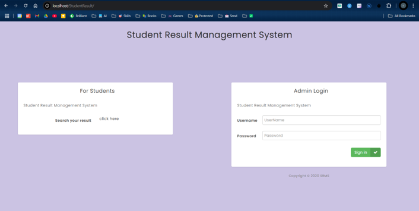
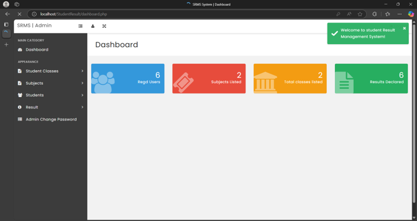
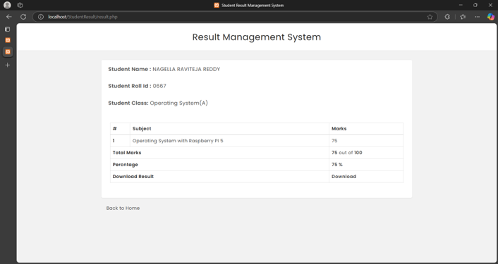

# 🎓 Student Result Management Portal
### Web-based Academic Result Management System


The **Student Result Management Portal (SRMS)** is a web-based academic management system developed using **PHP** and **MySQL**. It enables educational institutions to manage student records, subjects, classes, results, and notices through an admin panel while allowing students to view their academic results using their Roll ID.

---

# 📂 Repository Structure

```text
Student-Result-Management-Portal/
│
├── DB/                     # Database schema
├── css/                    # Stylesheets
├── dompdf/                 # PDF generation library
├── fonts/                  # Font assets
├── images/                 # Image assets
├── includes/               # Common PHP components
├── js/                     # JavaScript files
├── saas/                   # SCSS source files
├── screenshots/            # Project screenshots
│
├── index.php               # Home page
├── add-students.php        # Student management
├── add-result.php          # Result management
├── README.md
└── ...
```

---

# 🏗 System Architecture

```text
                ┌──────────────────────┐
                │      Student         │
                └──────────┬───────────┘
                           │
                    Result Search
                           │
                           ▼
               PHP Web Application
                           │
        ┌──────────────────┼──────────────────┐
        │                  │                  │
        ▼                  ▼                  ▼
 Admin Dashboard      Result Engine      Notice Module
        │                  │
        └──────────────┬───┘
                       ▼
                 MySQL Database
```

---

# ✨ Key Highlights

- 🎓 Student Result Management
- 👨‍💼 Admin Dashboard
- 📚 Class & Subject Management
- 📝 Result Declaration and Editing
- 🔍 Student Result Search
- 📢 Notice Board Management
- 🔐 Admin Authentication
- 📄 PDF Result Download
- ⚡ Database-driven Web Application

---

# 🛠 Technology Stack

| Category | Technologies |
|----------|--------------|
| Backend | PHP |
| Database | MySQL |
| Frontend | HTML5 • CSS3 • JavaScript |
| Dynamic UI | AJAX • jQuery |
| PDF Generation | DOMPDF |
| Local Server | XAMPP • WAMP • MAMP • LAMP |
| Browser Support | Chrome • Firefox • Opera • Edge |

---

# 📱 Modules

## 👨‍💼 Administrator Module

> 📖 **Description**  
> The administrator portal allows admins to manage students, classes, subjects, notices, and academic results through a secure dashboard.

> 🛠 **Features**  
> Dashboard • Student Management • Class Management • Subject Management • Result Management • Notice Management • Password Management

---

## 👨‍🎓 Student Module

> 📖 **Description**  
> Students can search and view their academic results using their Roll ID and download their result details.

> 🛠 **Features**  
> Result Search • View Result • Download Result • Notice Access

---

# 📸 Project Screenshots

## 🔐 Authentication Page

<p align="center">
  
</p>

---

## 📊 Admin Dashboard

<p align="center">
  
</p>

---

## 👨‍🎓 Manage Students

<p align="center">
  
</p>

---

## 📄 Student Result Page

<p align="center">
  
</p>

---

# 🚀 Getting Started

## 1. Clone Repository

```bash
git clone https://github.com/Nravitejareddy/Student-Result-Management-Portal.git

cd Student-Result-Management-Portal
```

---

## 2. Install Project

Copy the project folder into your local server directory.

Example for XAMPP:

```text
C:\xampp\htdocs\
```

Final location:

```text
C:\xampp\htdocs\Student-Result-Management-Portal
```

---

## 3. Start Services

Open **XAMPP Control Panel** and start:

```text
Apache
MySQL
```

---

## 4. Database Setup

Open phpMyAdmin:

```text
http://localhost/phpmyadmin
```

Create a database named:

```text
srms
```

Import:

```text
DB/srms.sql
```

---

## 5. Run the Application

Open your browser:

```text
http://localhost/Student-Result-Management-Portal/
```

---

# 🔑 Default Credentials

## 👨‍💼 Administrator

```text
Username : admin
Password : Test@123
```

---

## 👨‍🎓 Sample Student Details

```text
Student Name : NAGELLA RAVITEJA REDDY
Roll ID      : 0667
Class        : Operating System (A)
```

---

# 📈 Future Enhancements

- 📧 Email Notifications
- 📱 Mobile Responsive Dashboard
- 📊 Advanced Result Analytics
- 📥 Excel Export
- ☁️ Cloud Deployment
- 🔐 Two-Factor Authentication
- 👨‍🏫 Faculty Portal
- 📚 Semester-wise Performance Tracking

---

# 📄 License

This project was developed as an academic project and is maintained for educational and portfolio purposes.

---

# 👨‍💻 Author

**Ravi Teja Reddy N**

Computer Science & Engineering Graduate

🐙 GitHub: <https://github.com/Nravitejareddy>

---

# ⭐ Project Status

> ✅ **Completed** — Developed as an academic web application demonstrating PHP, MySQL, CRUD operations, authentication, and database-driven result management.

---

> **Student Result Management Portal — Simplifying Academic Result Administration through Web Technology.**
